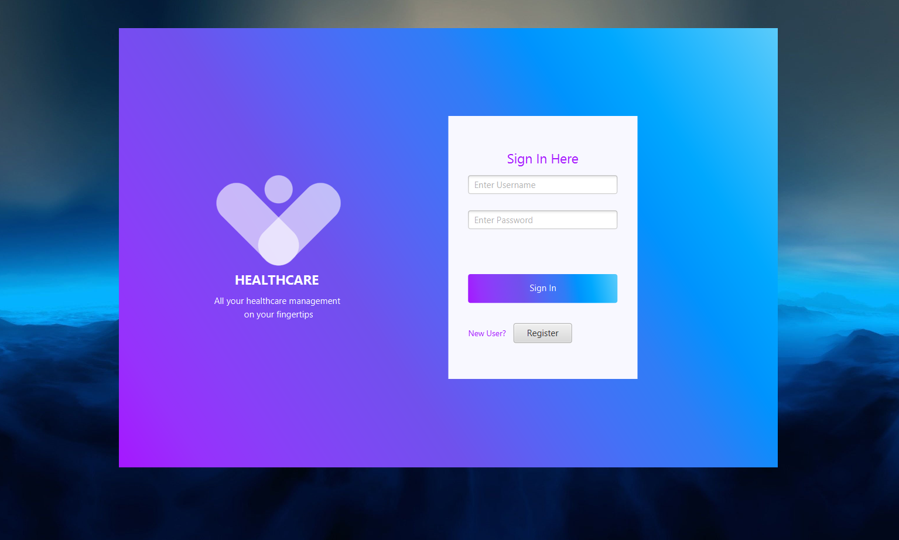
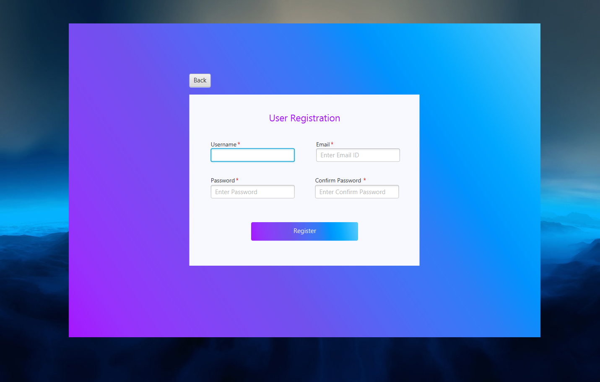
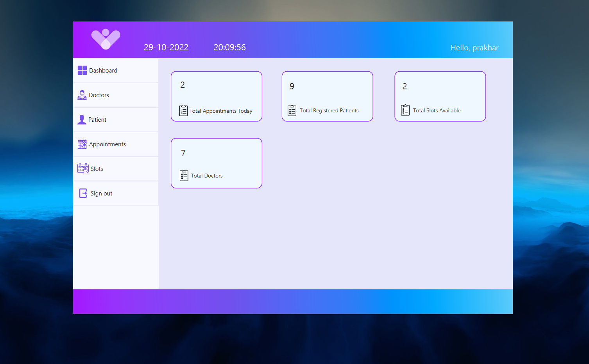
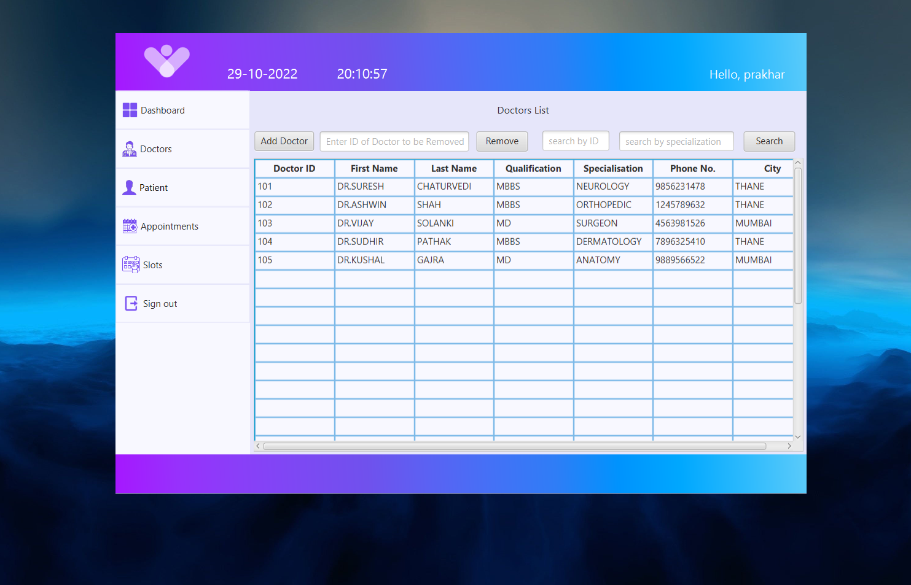
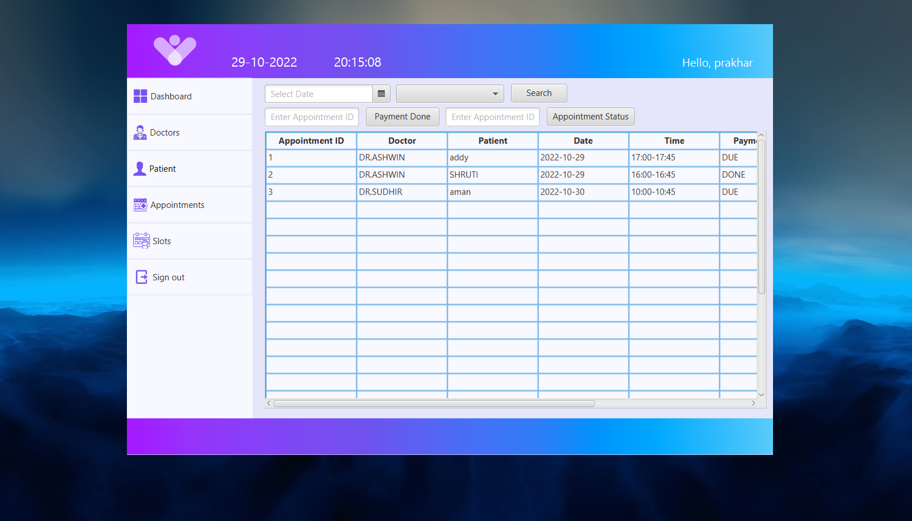
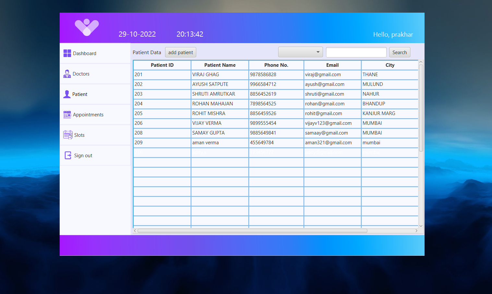
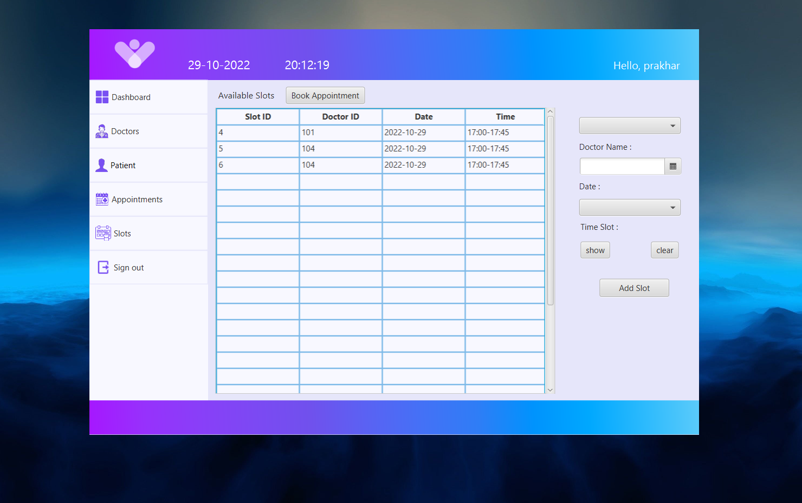
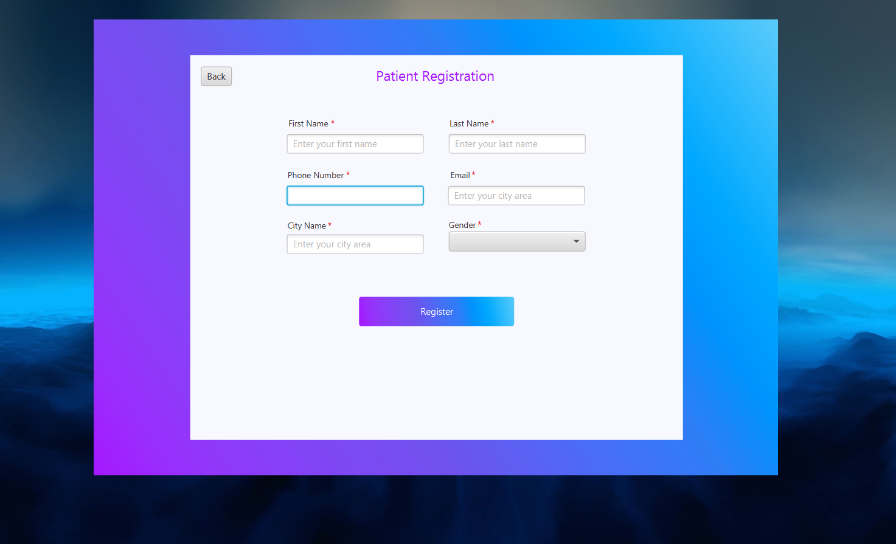

# JavaMiniProject

# Clinic Management System

## What is Clinic Management System?
* An Appointment Booking System
* Manages Patient and Doctor Records

###

| Features                 | 
|--------------------------|
| User Registration        | 
| Check Appointments       | 
| Book Appointments        |
| View Patient Records     |
| View Doctor Data         |
| *Reschedule Appointments |

## Technologies Used :
* Intellij IDE
* JavaFX Scene-builder
* MySQL
* MySQL Workbench

###
Team Members - 

Prakhar Sharma : https://github.com/Prakhar29Sharma

Divij Sarkale : https://github.com/divijms07

Sraina Panchangam : https://github.com/PSraina

Siddhesh Patil : https://github.com/siddesh1672003

#

<h2 id="snip">UI-Snippets</h2>

